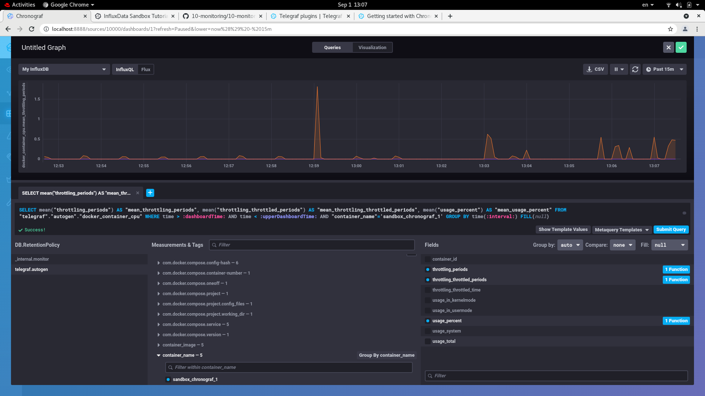

# Домашнее задание к занятию "10.02. Системы мониторинга"

## Обязательные задания

1. Опишите основные плюсы и минусы pull и push систем мониторинга.
Pull - инициатором является система мониторинга, поэтому, если цель находится за Firewall или за NAT, требуется дополнителные настройки Firewall, или proxy.  

Push требует, чтобы отслеживаемая цель знала адрес системы мониторинга, поэтому эта часть информации должна быть настроена в агенте.Агент зависит от системы мониторинга. Если адрес системы мониторинга изменится, необходимо изменять все сервисы.

2. Какие из ниже перечисленных систем относятся к push модели, а какие к pull? А может есть гибридные?

    - Prometheus pull - модель
    - TICK - push - модель
    - Zabbix - гибридная модель
    - VictoriaMetrics - СУБД
    - Nagios pull - модель


```bash
[admin@rhel-home sandbox]$ curl http://localhost:8888
<!DOCTYPE html><html><head><meta http-equiv="Content-type" content="text/html; charset=utf-8"><title>Chronograf</title><link rel="icon shortcut" href="/favicon.fa749080.ico"><link rel="stylesheet" href="/src.d80ed715.css"></head><body> <div id="react-root" data-basepath=""></div> <script src="/src.c278d833.js"></script> </body></html>
[admin@rhel-home sandbox]$ curl http://localhost:9092/kapacitor/v1/ping
[admin@rhel-home sandbox]$ 
```


4. 

5. 
