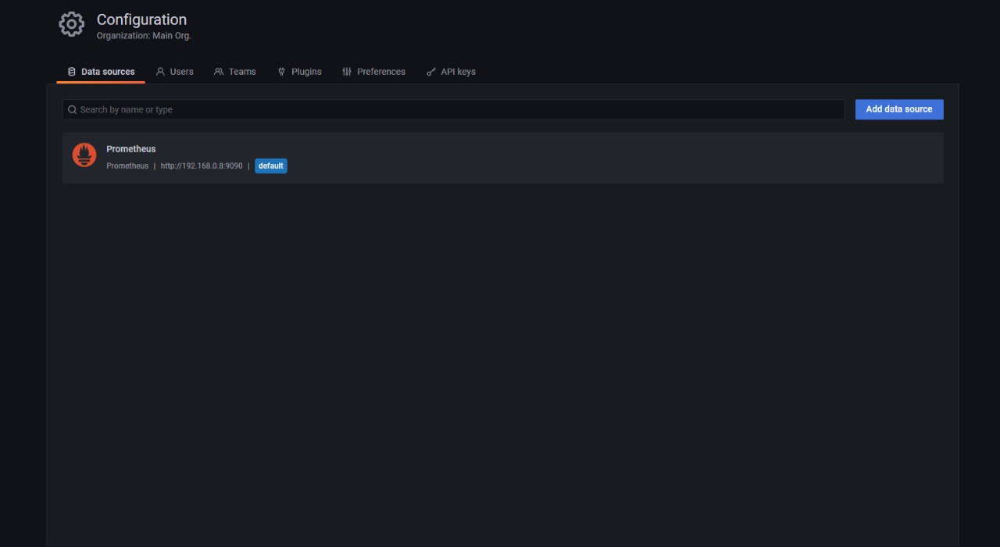
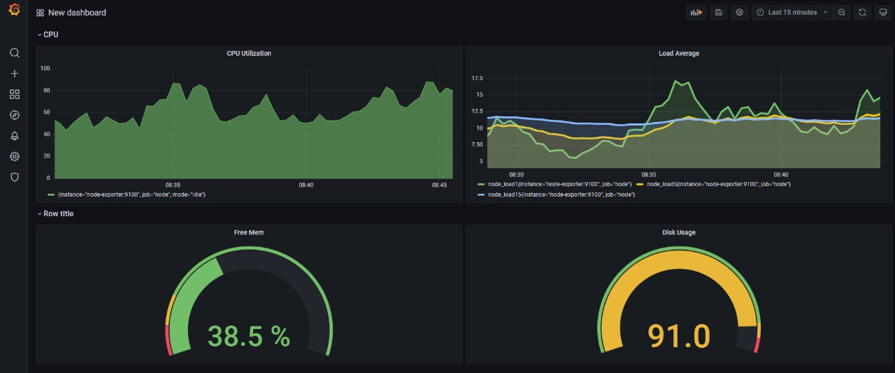
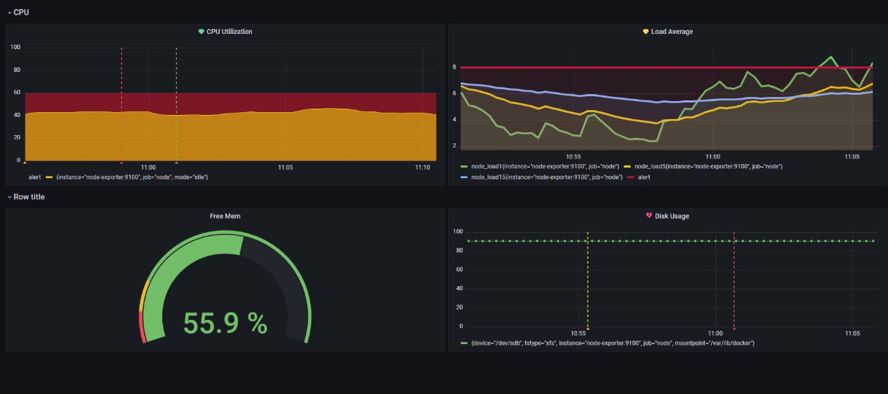

# Домашнее задание к занятию "10.03. Grafana"
Подготовка:  

Не нашел как победить, иначе графана не стартует 


`mkdir grafana && chown 1000:1000 grafana`


```yml
version: '3'
services:
    prometheus:
        container_name: prometheus
        image: prom/prometheus:latest
        depends_on:
            - node-exporter
        volumes:
            - ./prometheus:/etc/prometheus/
        command:
            - --config.file=/etc/prometheus/prometheus.yml
        ports:
            - 9090:9090
        restart: always
    node-exporter:
        container_name: node-exporter
        image: prom/node-exporter
        volumes:
            - /proc:/host/proc:ro
            - /sys:/host/sys:ro
            - /:/rootfs:ro
        command:
            - --path.procfs=/host/proc
            - --path.sysfs=/host/sys
            - --path.rootfs=/rootfs
            - --collector.filesystem.ignored-mount-points
            - ^/(sys|proc|dev|host|etc|rootfs/var/lib/docker/containers|rootfs/var/lib/docker/overlay2|rootfs/run/docker/netns|rootfs/var/lib/docker/aufs)($$|/)
        ports:
            - 9100:9100
        restart: always
    grafana:
        container_name: grafana
        image: grafana/grafana
        depends_on:
            - prometheus
        ports:
            - 3000:3000
        user: '1000'
        volumes:
            - ./grafana:/var/lib/grafana
            - ./grafana/provisioning/:/etc/grafana/provisioning/
        restart: always
```

Конфигурация prometheus минимальная

```yml
# my global config
global:
  scrape_interval: 15s
  evaluation_interval: 30s

scrape_configs:
  - job_name: 'node'
    static_configs:
      - targets: ['node-exporter:9100']
```
### Задание 1



## Задание 2

Dashboard Panels:
- Утилизация CPU для nodeexporter (в процентах, 100-idle)  
    `100-avg(rate(node_cpu_seconds_total{mode="idle"}[30s]))without(cpu)*100`
- CPULA 1/5/15  
    `node_load1`
    `node_load5`
    `node_load15`
- Количество свободной оперативной памяти  
    `((node_memory_MemFree_bytes+node_memory_Buffers_bytes+node_memory_Cached_bytes)/node_memory_MemTotal_bytes)*100`
- Количество места на файловой системе  
    `(node_filesystem_avail_bytes/node_filesystem_size_bytes)*100`


## Задание 3


## Задание 4
```json
{
  "annotations": {
    "list": [
      {
        "builtIn": 1,
        "datasource": "-- Grafana --",
        "enable": true,
        "hide": true,
        "iconColor": "rgba(0, 211, 255, 1)",
        "name": "Annotations & Alerts",
        "target": {
          "limit": 100,
          "matchAny": false,
          "tags": [],
          "type": "dashboard"
        },
        "type": "dashboard"
      }
    ]
  },
  "editable": true,
  "gnetId": null,
  "graphTooltip": 0,
  "id": 1,
  "links": [],
  "panels": [
    {
      "collapsed": false,
      "datasource": null,
      "gridPos": {
        "h": 1,
        "w": 24,
        "x": 0,
        "y": 0
      },
      "id": 4,
      "panels": [],
      "title": "CPU",
      "type": "row"
    },
    {
      "alert": {
        "alertRuleTags": {},
        "conditions": [
          {
            "evaluator": {
              "params": [
                60
              ],
              "type": "gt"
            },
            "operator": {
              "type": "and"
            },
            "query": {
              "params": [
                "A",
                "5m",
                "now"
              ]
            },
            "reducer": {
              "params": [],
              "type": "avg"
            },
            "type": "query"
          }
        ],
        "executionErrorState": "alerting",
        "for": "5m",
        "frequency": "1m",
        "handler": 1,
        "message": "CPU Utilization is above 55%",
        "name": "CPU Utilization alert",
        "noDataState": "alerting",
        "notifications": [
          {
            "uid": "1tNgSannz"
          }
        ]
      },
      "datasource": null,
      "description": "",
      "fieldConfig": {
        "defaults": {
          "color": {
            "mode": "palette-classic"
          },
          "custom": {
            "axisLabel": "",
            "axisPlacement": "auto",
            "barAlignment": 0,
            "drawStyle": "line",
            "fillOpacity": 58,
            "gradientMode": "none",
            "hideFrom": {
              "legend": false,
              "tooltip": false,
              "viz": false
            },
            "lineInterpolation": "linear",
            "lineWidth": 1,
            "pointSize": 1,
            "scaleDistribution": {
              "type": "linear"
            },
            "showPoints": "auto",
            "spanNulls": false,
            "stacking": {
              "group": "A",
              "mode": "none"
            },
            "thresholdsStyle": {
              "mode": "off"
            }
          },
          "mappings": [],
          "max": 100,
          "min": 0,
          "thresholds": {
            "mode": "percentage",
            "steps": [
              {
                "color": "green",
                "value": null
              },
              {
                "color": "red",
                "value": 80
              }
            ]
          }
        },
        "overrides": [
          {
            "matcher": {
              "id": "byName",
              "options": "alert"
            },
            "properties": [
              {
                "id": "color",
                "value": {
                  "fixedColor": "#c4162a05",
                  "mode": "fixed"
                }
              }
            ]
          }
        ]
      },
      "gridPos": {
        "h": 9,
        "w": 12,
        "x": 0,
        "y": 1
      },
      "id": 2,
      "options": {
        "legend": {
          "calcs": [],
          "displayMode": "list",
          "placement": "bottom"
        },
        "tooltip": {
          "mode": "single"
        }
      },
      "targets": [
        {
          "exemplar": true,
          "expr": "60",
          "hide": false,
          "interval": "",
          "legendFormat": "alert",
          "refId": "B"
        },
        {
          "exemplar": true,
          "expr": "100-avg(rate(node_cpu_seconds_total{mode=\"idle\"}[5m]))without(cpu)*100",
          "interval": "",
          "legendFormat": "",
          "refId": "A"
        }
      ],
      "thresholds": [
        {
          "colorMode": "critical",
          "op": "gt",
          "value": 60,
          "visible": true
        }
      ],
      "title": "CPU Utilization",
      "type": "timeseries"
    },
    {
      "alert": {
        "alertRuleTags": {},
        "conditions": [
          {
            "evaluator": {
              "params": [
                5
              ],
              "type": "gt"
            },
            "operator": {
              "type": "and"
            },
            "query": {
              "params": [
                "A",
                "5m",
                "now"
              ]
            },
            "reducer": {
              "params": [],
              "type": "avg"
            },
            "type": "query"
          }
        ],
        "executionErrorState": "alerting",
        "for": "5m",
        "frequency": "1m",
        "handler": 1,
        "message": "Load Average alert",
        "name": "Load Average alert",
        "noDataState": "no_data",
        "notifications": [
          {
            "uid": "1tNgSannz"
          }
        ]
      },
      "datasource": null,
      "fieldConfig": {
        "defaults": {
          "color": {
            "mode": "palette-classic"
          },
          "custom": {
            "axisLabel": "",
            "axisPlacement": "auto",
            "barAlignment": 0,
            "drawStyle": "line",
            "fillOpacity": 10,
            "gradientMode": "none",
            "hideFrom": {
              "legend": false,
              "tooltip": false,
              "viz": false
            },
            "lineInterpolation": "linear",
            "lineWidth": 4,
            "pointSize": 1,
            "scaleDistribution": {
              "type": "linear"
            },
            "showPoints": "auto",
            "spanNulls": false,
            "stacking": {
              "group": "A",
              "mode": "none"
            },
            "thresholdsStyle": {
              "mode": "off"
            }
          },
          "mappings": [],
          "thresholds": {
            "mode": "absolute",
            "steps": [
              {
                "color": "green",
                "value": null
              },
              {
                "color": "red",
                "value": 80
              }
            ]
          }
        },
        "overrides": [
          {
            "matcher": {
              "id": "byName",
              "options": "8"
            },
            "properties": [
              {
                "id": "color",
                "value": {
                  "fixedColor": "dark-red",
                  "mode": "fixed"
                }
              }
            ]
          },
          {
            "matcher": {
              "id": "byName",
              "options": "alert"
            },
            "properties": [
              {
                "id": "color",
                "value": {
                  "fixedColor": "#c41635",
                  "mode": "fixed"
                }
              }
            ]
          }
        ]
      },
      "gridPos": {
        "h": 9,
        "w": 12,
        "x": 12,
        "y": 1
      },
      "id": 6,
      "options": {
        "legend": {
          "calcs": [],
          "displayMode": "list",
          "placement": "bottom"
        },
        "tooltip": {
          "mode": "single"
        }
      },
      "targets": [
        {
          "exemplar": true,
          "expr": "node_load1",
          "interval": "",
          "legendFormat": "",
          "refId": "A"
        },
        {
          "exemplar": true,
          "expr": "node_load5",
          "hide": false,
          "interval": "",
          "legendFormat": "",
          "refId": "B"
        },
        {
          "exemplar": true,
          "expr": "node_load15",
          "hide": false,
          "interval": "",
          "legendFormat": "",
          "refId": "C"
        },
        {
          "exemplar": true,
          "expr": "8",
          "hide": false,
          "interval": "",
          "legendFormat": "alert",
          "refId": "D"
        }
      ],
      "thresholds": [
        {
          "colorMode": "critical",
          "op": "gt",
          "value": 5,
          "visible": true
        }
      ],
      "title": "Load Average",
      "type": "timeseries"
    },
    {
      "collapsed": false,
      "datasource": null,
      "gridPos": {
        "h": 1,
        "w": 24,
        "x": 0,
        "y": 10
      },
      "id": 8,
      "panels": [],
      "title": "Row title",
      "type": "row"
    },
    {
      "datasource": null,
      "fieldConfig": {
        "defaults": {
          "color": {
            "mode": "thresholds"
          },
          "decimals": 1,
          "mappings": [],
          "max": 100,
          "min": 0,
          "thresholds": {
            "mode": "percentage",
            "steps": [
              {
                "color": "green",
                "value": null
              },
              {
                "color": "red",
                "value": 0
              },
              {
                "color": "#EAB839",
                "value": 10
              },
              {
                "color": "green",
                "value": 20
              }
            ]
          },
          "unit": "%"
        },
        "overrides": []
      },
      "gridPos": {
        "h": 8,
        "w": 12,
        "x": 0,
        "y": 11
      },
      "id": 10,
      "options": {
        "orientation": "auto",
        "reduceOptions": {
          "calcs": [
            "lastNotNull"
          ],
          "fields": "",
          "values": false
        },
        "showThresholdLabels": false,
        "showThresholdMarkers": true,
        "text": {}
      },
      "pluginVersion": "8.1.2",
      "targets": [
        {
          "exemplar": true,
          "expr": "((node_memory_MemFree_bytes+node_memory_Buffers_bytes+node_memory_Cached_bytes)/node_memory_MemTotal_bytes)*100",
          "interval": "",
          "legendFormat": "",
          "refId": "A"
        }
      ],
      "title": "Free Mem",
      "type": "gauge"
    },
    {
      "alert": {
        "alertRuleTags": {},
        "conditions": [
          {
            "evaluator": {
              "params": [
                80
              ],
              "type": "gt"
            },
            "operator": {
              "type": "and"
            },
            "query": {
              "params": [
                "A",
                "5m",
                "now"
              ]
            },
            "reducer": {
              "params": [],
              "type": "avg"
            },
            "type": "query"
          }
        ],
        "executionErrorState": "alerting",
        "for": "5m",
        "frequency": "1m",
        "handler": 1,
        "message": "Disk Usage alert",
        "name": "Disk Usage alert",
        "noDataState": "no_data",
        "notifications": [
          {
            "uid": "1tNgSannz"
          }
        ]
      },
      "datasource": null,
      "fieldConfig": {
        "defaults": {
          "color": {
            "mode": "palette-classic"
          },
          "custom": {
            "axisLabel": "",
            "axisPlacement": "auto",
            "barAlignment": 0,
            "drawStyle": "line",
            "fillOpacity": 0,
            "gradientMode": "none",
            "hideFrom": {
              "legend": false,
              "tooltip": false,
              "viz": false
            },
            "lineInterpolation": "linear",
            "lineWidth": 1,
            "pointSize": 5,
            "scaleDistribution": {
              "type": "linear"
            },
            "showPoints": "auto",
            "spanNulls": false,
            "stacking": {
              "group": "A",
              "mode": "none"
            },
            "thresholdsStyle": {
              "mode": "off"
            }
          },
          "mappings": [],
          "max": 100,
          "min": 0,
          "thresholds": {
            "mode": "absolute",
            "steps": [
              {
                "color": "green",
                "value": null
              },
              {
                "color": "#EAB839",
                "value": 90
              },
              {
                "color": "red",
                "value": 95
              }
            ]
          }
        },
        "overrides": []
      },
      "gridPos": {
        "h": 8,
        "w": 12,
        "x": 12,
        "y": 11
      },
      "id": 12,
      "options": {
        "legend": {
          "calcs": [],
          "displayMode": "list",
          "placement": "bottom"
        },
        "tooltip": {
          "mode": "single"
        }
      },
      "pluginVersion": "8.1.2",
      "targets": [
        {
          "exemplar": true,
          "expr": "(node_filesystem_avail_bytes/node_filesystem_size_bytes)*100",
          "interval": "",
          "legendFormat": "",
          "refId": "A"
        }
      ],
      "thresholds": [
        {
          "colorMode": "critical",
          "op": "gt",
          "value": 80,
          "visible": true
        }
      ],
      "title": "Disk Usage",
      "type": "timeseries"
    }
  ],
  "refresh": false,
  "schemaVersion": 30,
  "style": "dark",
  "tags": [],
  "templating": {
    "list": []
  },
  "time": {
    "from": "now-15m",
    "to": "now"
  },
  "timepicker": {},
  "timezone": "",
  "title": "New dashboard Copy",
  "uid": "NNwEman7z",
  "version": 6
}

---
```
