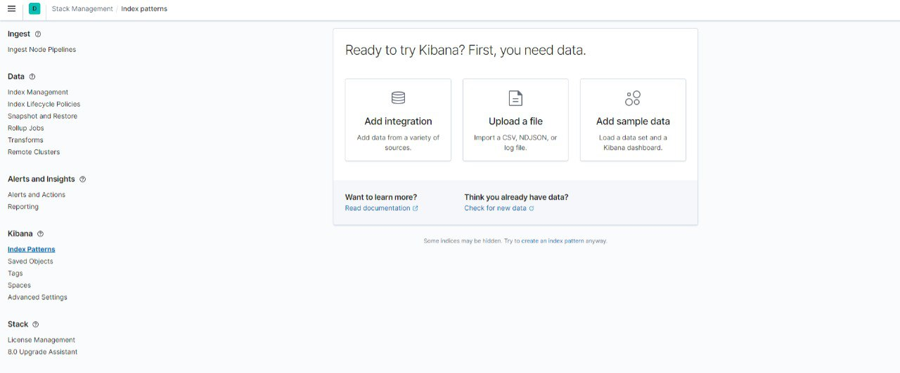

# Домашнее задание к занятию "10.04. ELK"

## Дополнительные ссылки

При выполнении задания пользуйтесь вспомогательными ресурсами:

- [поднимаем elk в докер](https://www.elastic.co/guide/en/elastic-stack-get-started/current/get-started-docker.html)
- [поднимаем elk в докер с filebeat и докер логами](https://www.sarulabs.com/post/5/2019-08-12/sending-docker-logs-to-elasticsearch-and-kibana-with-filebeat.html)
- [конфигурируем logstash](https://www.elastic.co/guide/en/logstash/current/configuration.html)
- [плагины filter для logstash](https://www.elastic.co/guide/en/logstash/current/filter-plugins.html)
- [конфигурируем filebeat](https://www.elastic.co/guide/en/beats/libbeat/5.3/config-file-format.html)
- [привязываем индексы из elastic в kibana](https://www.elastic.co/guide/en/kibana/current/index-patterns.html)
- [как просматривать логи в kibana](https://www.elastic.co/guide/en/kibana/current/discover.html)
- [решение ошибки increase vm.max_map_count elasticsearch](https://stackoverflow.com/questions/42889241/how-to-increase-vm-max-map-count)

В процессе выполнения задания могут возникнуть также не указанные тут проблемы в зависимости от системы.

Используйте output stdout filebeat/kibana и api elasticsearch для изучения корня проблемы и ее устранения.

## Задание 1

`$ docker ps
CONTAINER ID   IMAGE                                                  COMMAND                  CREATED         STATUS         PORTS                                        NAMES
f4e923cb7928   docker.elastic.co/beats/filebeat:7.2.0                 "/usr/local/bin/dock…"   7 minutes ago   Up 7 minutes                                                filebeat
9ce8020bb669   docker.elastic.co/kibana/kibana:7.11.0                 "/bin/tini -- /usr/l…"   7 minutes ago   Up 7 minutes   0.0.0.0:5601->5601/tcp                       kibana
f7e39fad9dd9   docker.elastic.co/logstash/logstash:6.3.2              "/usr/local/bin/dock…"   7 minutes ago   Up 7 minutes   5044/tcp, 9600/tcp, 0.0.0.0:5046->5046/tcp   logstash
b1835d78a469   docker.elastic.co/elasticsearch/elasticsearch:7.11.0   "/bin/tini -- /usr/l…"   7 minutes ago   Up 7 minutes   0.0.0.0:9200->9200/tcp, 9300/tcp             es-hot
2fe6b04e9e9b   python:3.9-alpine                                      "python3 /opt/run.py"    7 minutes ago   Up 7 minutes                                                some_app
aef62b2593e6   docker.elastic.co/elasticsearch/elasticsearch:7.11.0   "/bin/tini -- /usr/l…"   7 minutes ago   Up 7 minutes   9200/tcp, 9300/tcp                           es-warm` 

## Задание 2

Перейдите в меню [создания index-patterns  в kibana](http://localhost:5601/app/management/kibana/indexPatterns/create)
и создайте несколько index-patterns из имеющихся.

Перейдите в меню просмотра логов в kibana (Discover) и самостоятельно изучите как отображаются логи и как производить 
поиск по логам.

В манифесте директории help также приведенно dummy приложение, которое генерирует рандомные события в stdout контейнера.
Данные логи должны порождать индекс logstash-* в elasticsearch. Если данного индекса нет - воспользуйтесь советами 
и источниками из раздела "Дополнительные ссылки" данного ДЗ.
 
---

### Как оформить ДЗ?

Выполненное домашнее задание пришлите ссылкой на .md-файл в вашем репозитории.

---

 
