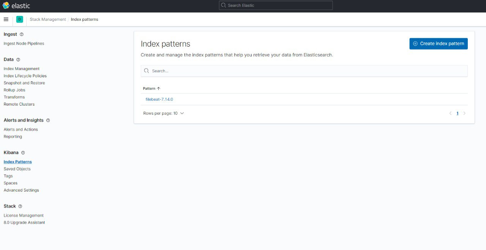

# Домашнее задание к занятию "10.04. ELK"

## Задание 1
```bash
$ docker ps
CONTAINER ID   IMAGE                                                  COMMAND                  CREATED         STATUS         PORTS                                        NAMES  
f4e923cb7928   docker.elastic.co/beats/filebeat:7.2.0                 "/usr/local/bin/dock…"   7 minutes ago   Up 7 minutes                                                filebeat  
9ce8020bb669   docker.elastic.co/kibana/kibana:7.11.0                 "/bin/tini -- /usr/l…"   7 minutes ago   Up 7 minutes   0.0.0.0:5601->5601/tcp                       kibana  
f7e39fad9dd9   docker.elastic.co/logstash/logstash:6.3.2              "/usr/local/bin/dock…"   7 minutes ago   Up 7 minutes   5044/tcp, 9600/tcp, 0.0.0.0:5046->5046/tcp   logstash  
b1835d78a469   docker.elastic.co/elasticsearch/elasticsearch:7.11.0   "/bin/tini -- /usr/l…"   7 minutes ago   Up 7 minutes   0.0.0.0:9200->9200/tcp, 9300/tcp             es-hot  
2fe6b04e9e9b   python:3.9-alpine                                      "python3 /opt/run.py"    7 minutes ago   Up 7 minutes                                                some_app  
aef62b2593e6   docker.elastic.co/elasticsearch/elasticsearch:7.11.0   "/bin/tini -- /usr/l…"   7 minutes ago   Up 7 minutes   9200/tcp, 9300/tcp                           es-warm
```


## Задание 2
 

 
